# SocialApp

A Simple Social App That Allow users to create account and share there photos with a description and make a community.
Also other people can comment on your post ,and make likes.
Allow you to make user profile with your skills and share with other people.
You can Make friends by sending requests and start chat with them.
You receive notification by friends messages or friend requests.

  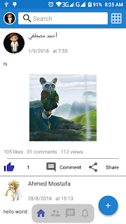
  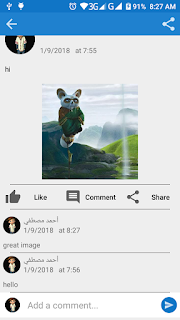
  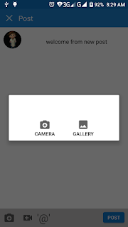
  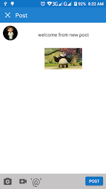
  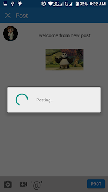
  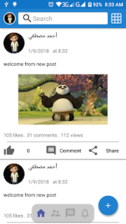
  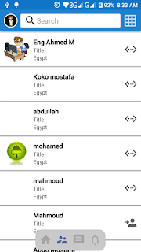
  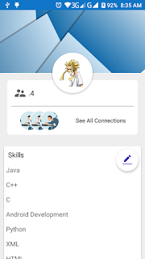
  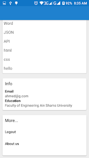
  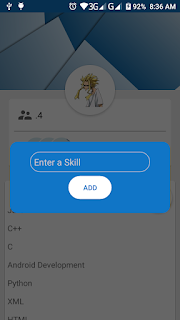
  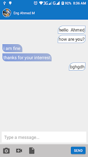
  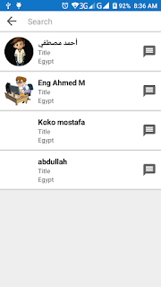
  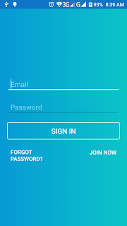
  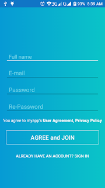

## Version 2.0
MVVM Pattern
